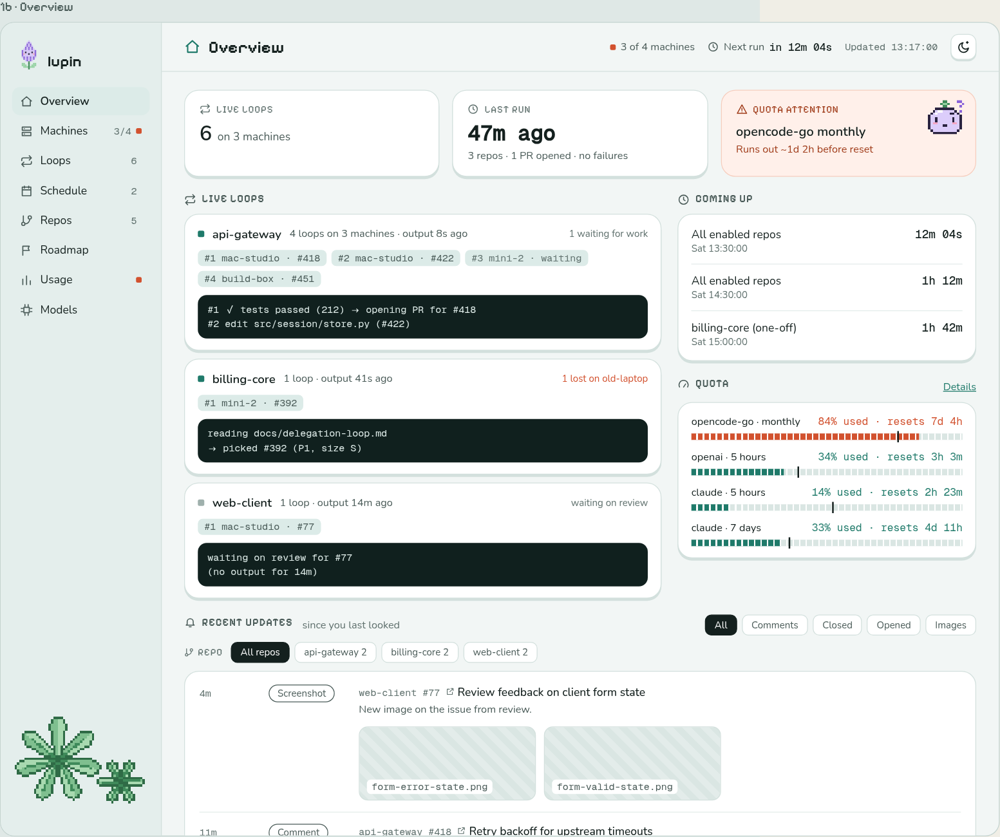
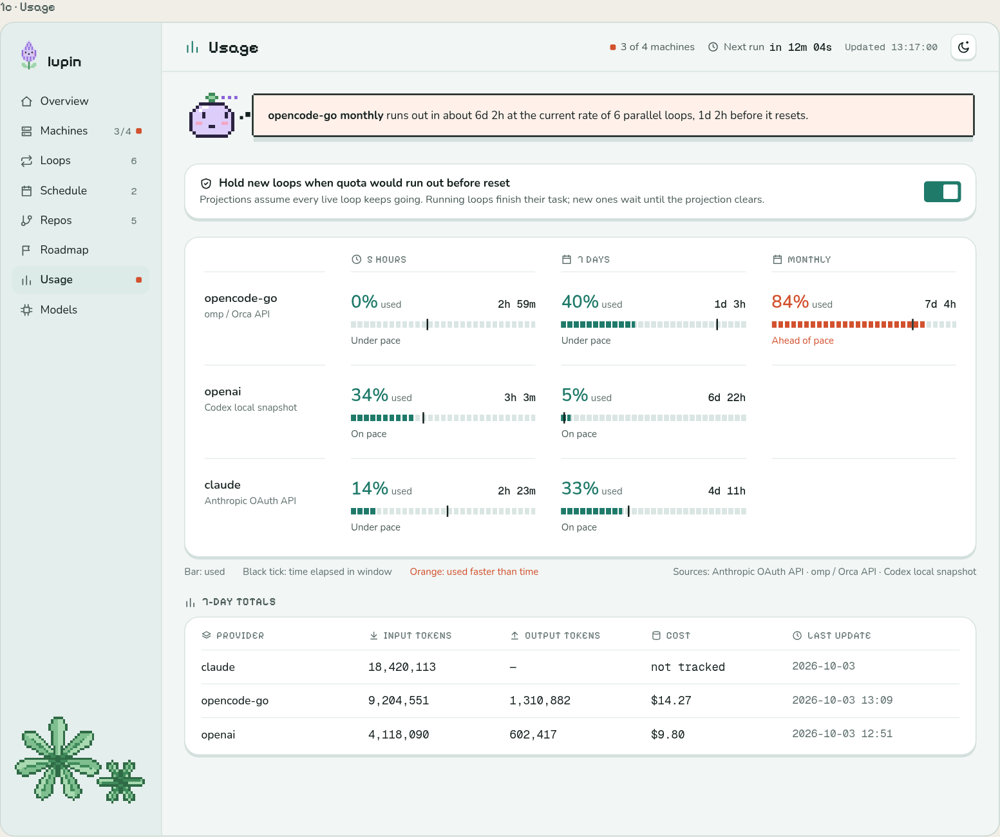
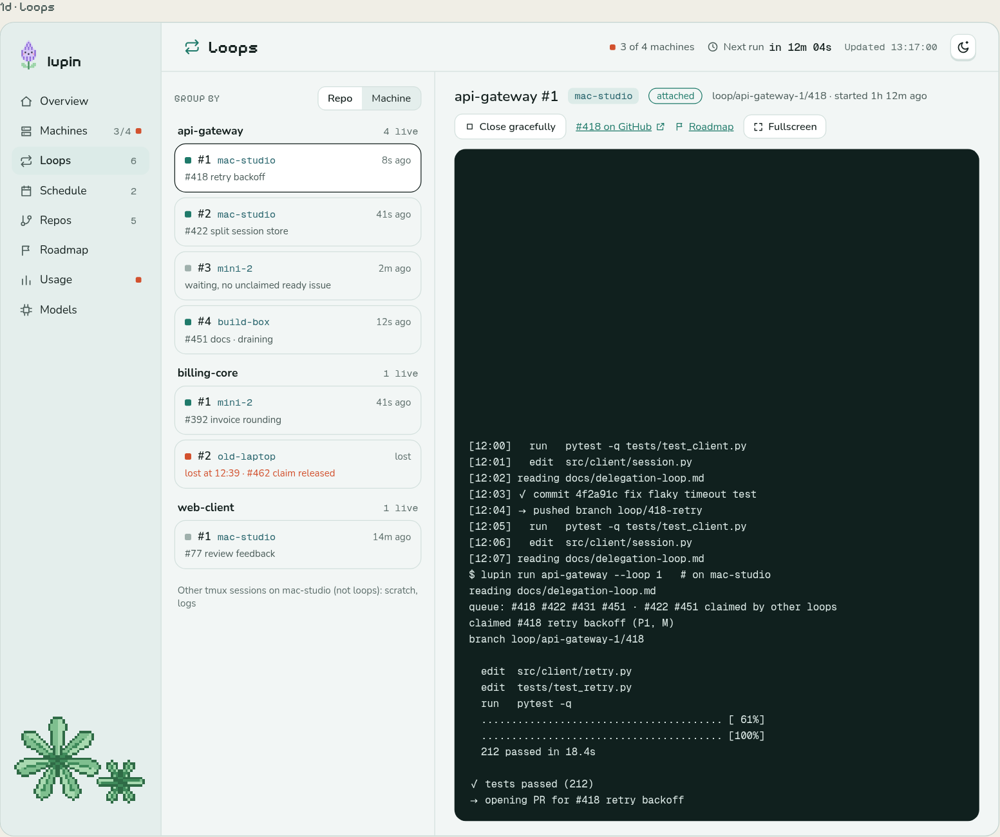
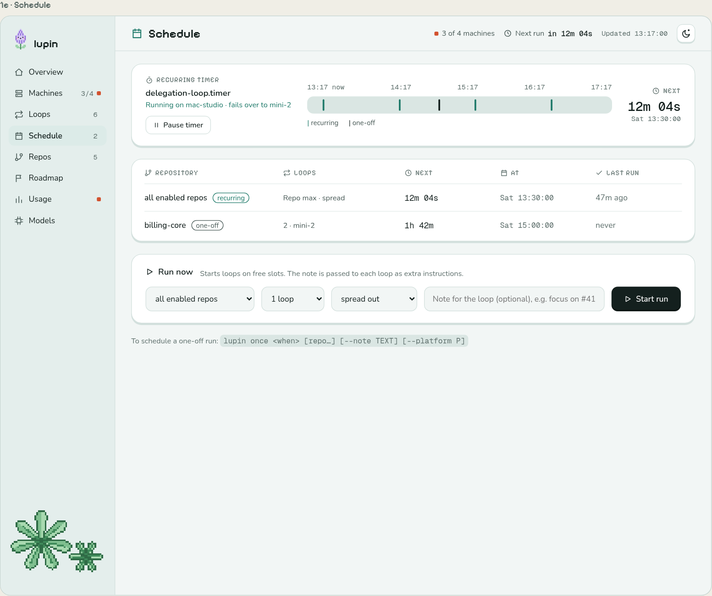
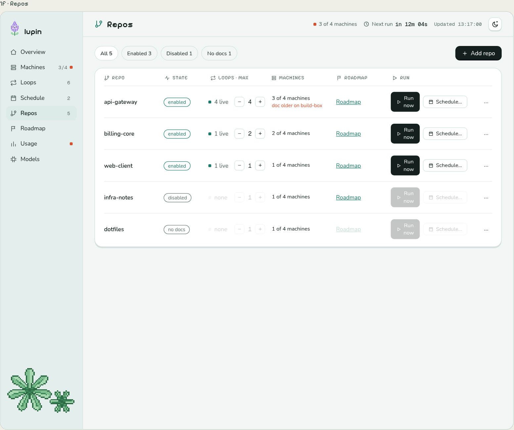
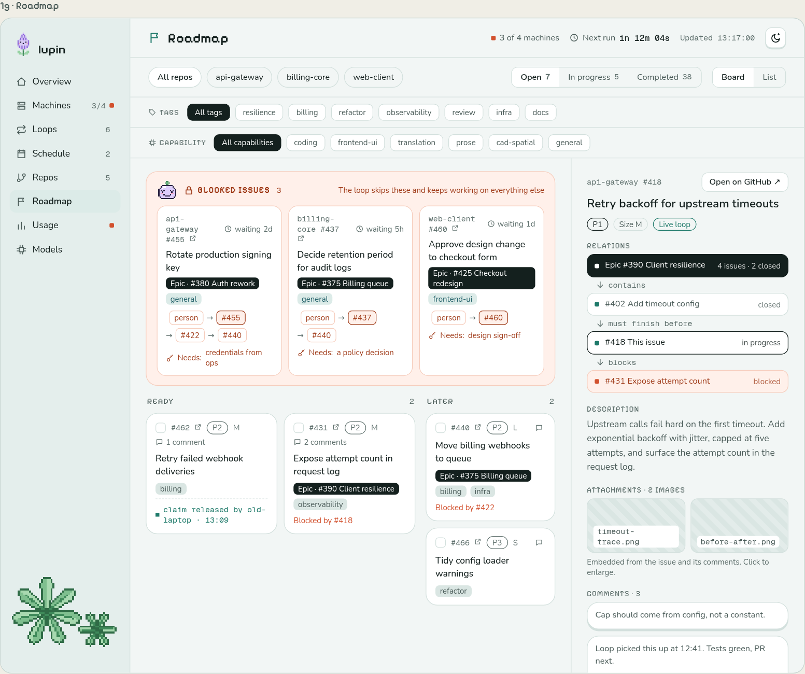
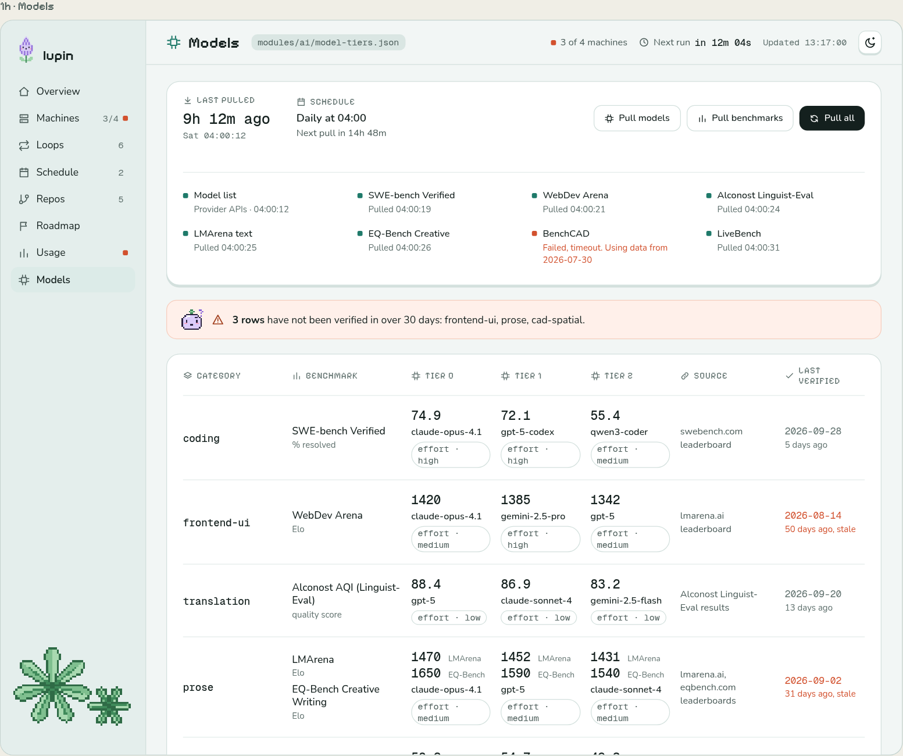
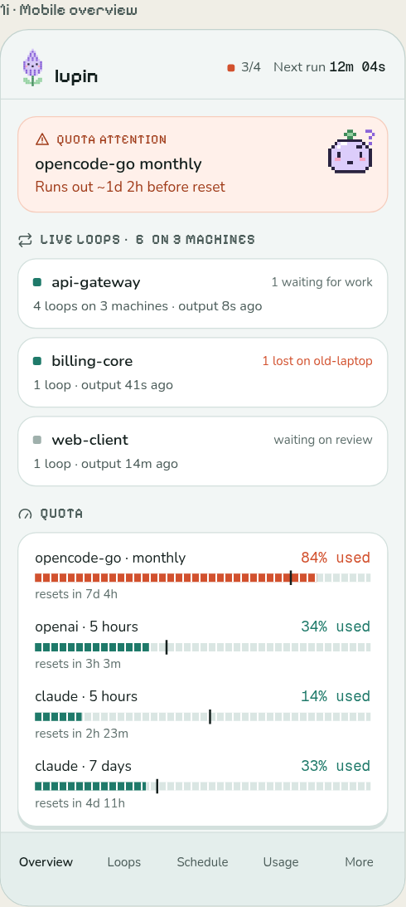
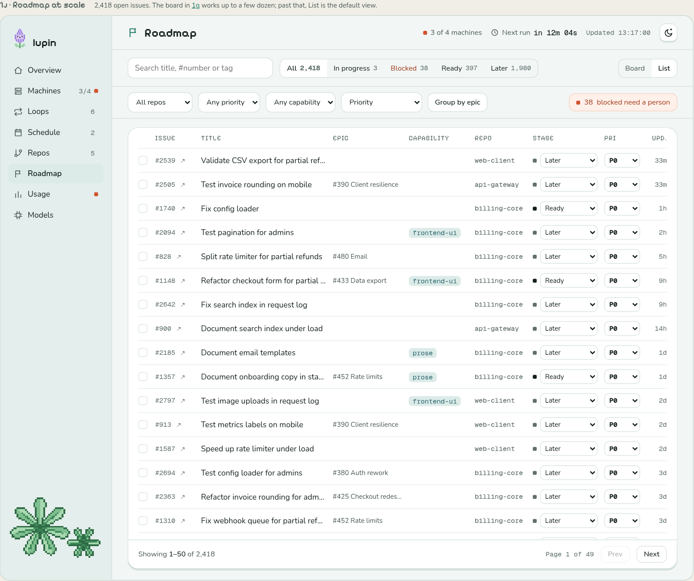
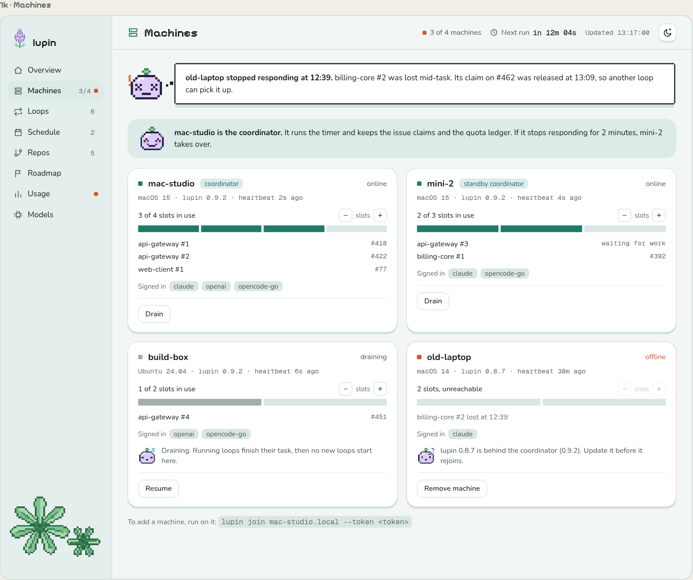

# Dashboard mockup screenshots

`ui.dc.html` is the source for these mockups. Use each screenshot as a visual reference. All displayed data is sample data.

## [1b · Overview](../ui.dc.html#1b)

## [1c · Usage](../ui.dc.html#1c)

## [1d · Loops](../ui.dc.html#1d)

## [1e · Schedule](../ui.dc.html#1e)

## [1f · Repos](../ui.dc.html#1f)

## [1g · Roadmap](../ui.dc.html#1g)

## [1h · Models](../ui.dc.html#1h)

## [1i · Mobile overview](../ui.dc.html#1i)

## [1j · Roadmap at scale](../ui.dc.html#1j)

## [1k · Machines](../ui.dc.html#1k)

